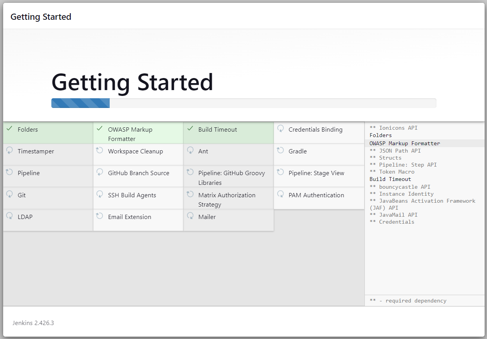
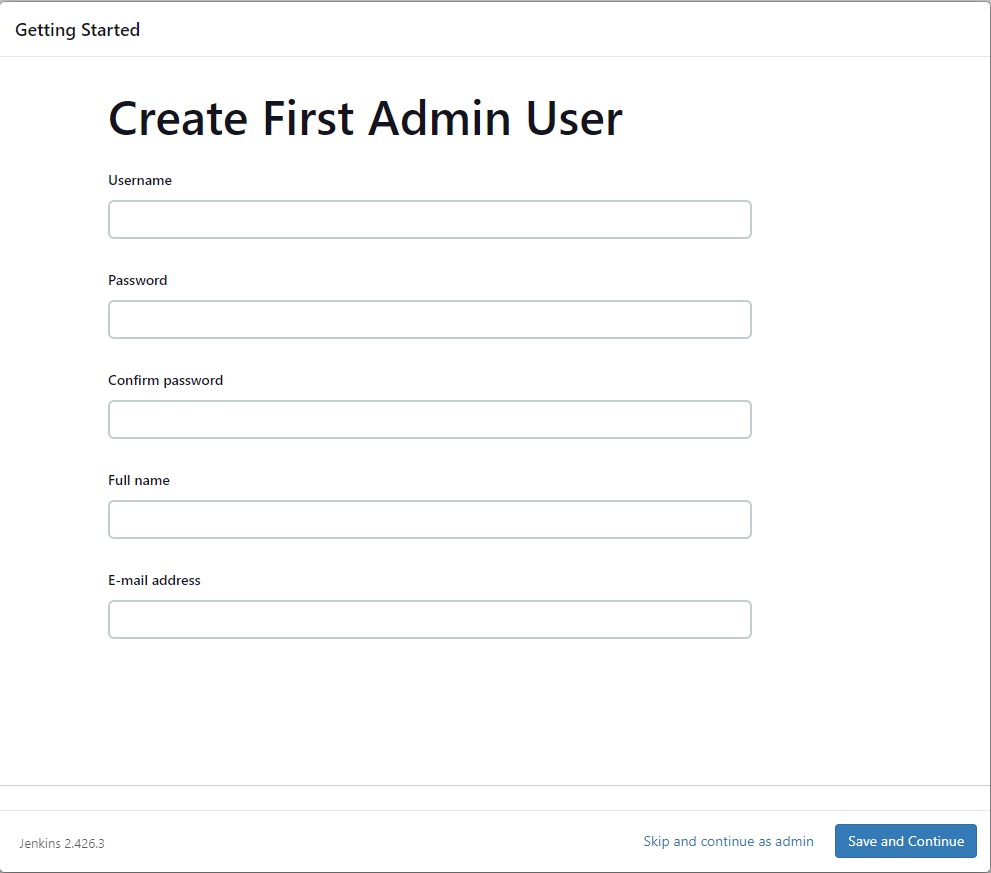
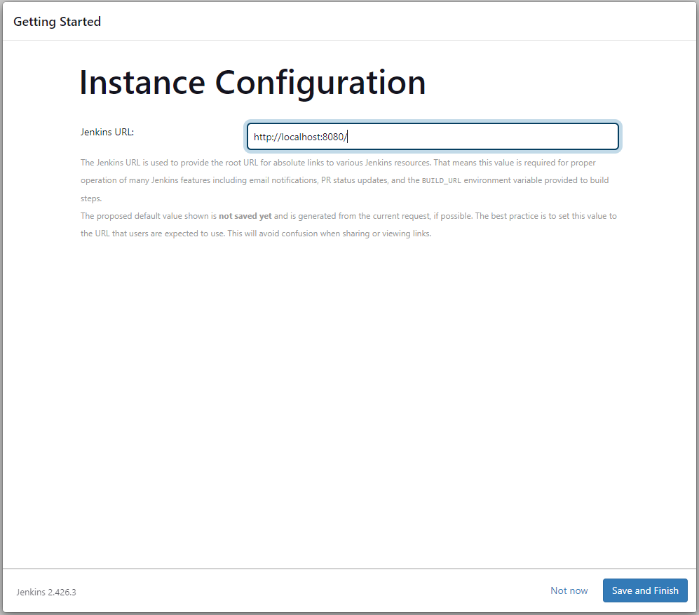
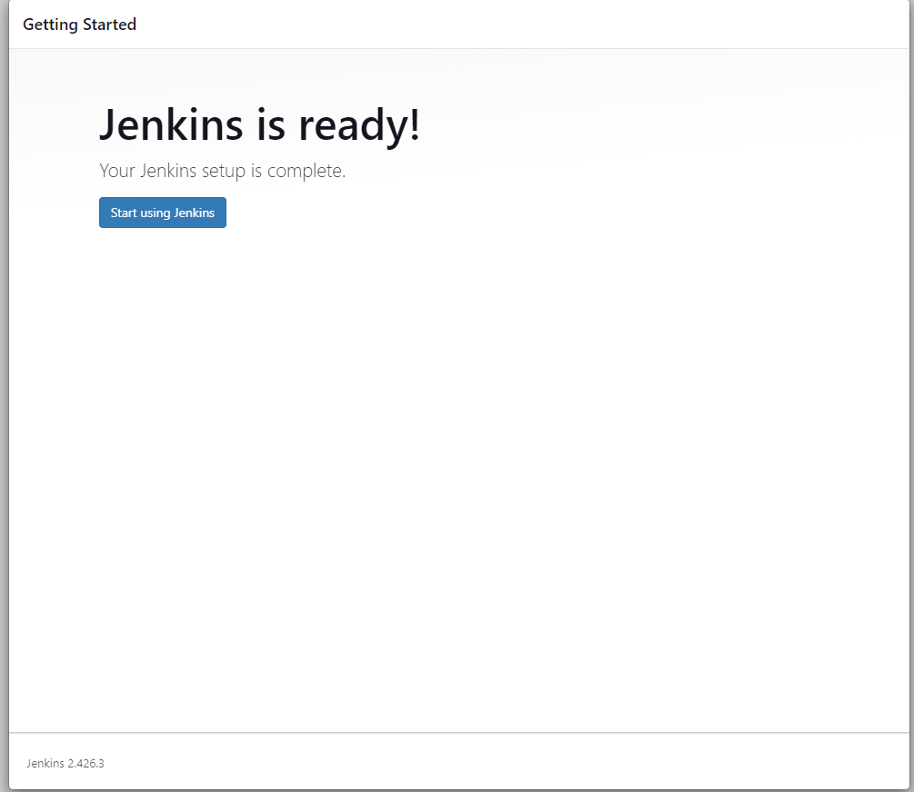

## How to Install jenkins on Ubuntu 22.04

### Introduction

Jenkins is an open-source automation server that automates the repetitive technical tasks involved in the continuous integration and delivery of software. Jenkins is Java-based, installed from Ubuntu packages or by downloading and running its web application archive (WAR) file — a collection of files that make up a complete web application to run on a server.

### Step 1: Installing Jenkins

    sudo wget -O /usr/share/keyrings/jenkins-keyring.asc https://pkg.jenkins.io/debian-stable/jenkins.io-2023.key
    echo deb [signed-by=/usr/share/keyrings/jenkins-keyring.asc] https://pkg.jenkins.io/debian-stable binary/ | sudo tee /etc/apt/sources.list.d/jenkins.list > /dev/null
    sudo apt-get update
    sudo apt-get install jenkins

### Step 2 — Starting Jenkins

    sudo service jenkins enable
    sudo service jenkins start
    sudo service jenkins status

### Step 3 — Opening the Firewall -- By default jenkins runs on port 8080. Open the port using ufw

    sudo ufw allow 8080
    sudo ufw allow ssh
    sudo ufw enable
    sudo ufw status

### Step 4 — Setting Up Jenkins

#### To set up your installation, visit Jenkins on its default port, 8080, using your server domain name or IP address: http://your_server_ip_or_domain:8080

#### You should receive the Unlock Jenkins screen, which displays the location of the initial password:

#### In the terminal window, use the cat command to display the password. Copy the 32-character alphanumeric password from the terminal and paste it into the Administrator password field, then click Continue.:

    sudo cat /var/lib/jenkins/secrets/initialAdminPassword

#### The next screen presents the option of installing suggested plugins or selecting specific plugins:

#### We’ll click the Install suggested plugins option, which will immediately begin the installation process.

#### After Installation is completed, the Below window will be displayed, Enter the name and password for your user and click save and Continue Button:

#### You’ll receive an Instance Configuration page that will ask you to confirm the preferred URL for your Jenkins instance. Confirm either the domain name for your server or your server’s IP address:

#### click save and finish Button. You’ll receive a confirmation page confirming that “Jenkins is Ready!”:

